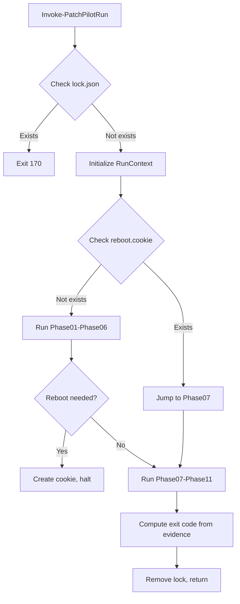

# Architecture Overview

## Executive Summary

PatchPilot is a PowerShell 7-based patch orchestration engine built for multi-tenant MSP environments. It provides deterministic, auditable patch management with evidence-based decision-making and compliance-ready reporting.

**Core Principles:**
- Evidence-First: All outcomes derive from persisted artifacts on disk
- Deterministic: Exit codes and state transitions are predictable
- Idempotent: Phases can resume safely after interruption
- Auditable: SHA-256 hash chains and Merkle roots provide integrity
- Config-First: Behavior controlled by JSON policies, not code

## System Design

### RunContext

The engine uses a central `RunContext` hashtable (implemented in `src/PatchPilot.Engine/Private/Initialize-RunContext.ps1`) that flows through all phases. No global state.

**Key Fields (from `Initialize-RunContext.ps1`):**
- `TenantId`, `ClientId`, `SiteId`, `DeviceId` - Multi-tenant identifiers
- `RunId` - GUID for this execution
- `OutputRoot` - Base directory for all artifacts
- `Checkpoint` - Last completed phase/step (for resume)
- `ToolVersion` - Engine version
- `StartTime` - UTC timestamp
- `ExitCode` - Final exit code (set at end)
- `ConfigPath` - Path to ClientProfile.json
- `EffectiveConfig` - (Inferred) Merged policies from all layers

### Entry Point

**Function:** `Invoke-PatchPilotRun` (in `src/PatchPilot.Engine/Public/Invoke-PatchPilotRun.ps1`)

**Parameters:**
- `OutputRoot` - Where to write all artifacts
- `ConfigPath` - Path to `ClientProfile.json`
- `TenantId` - Tenant identifier
- `ClientId` - Client identifier
- `SiteId` - Site identifier (default: 'Default')
- `DeviceId` - Device identifier (default: `$env:COMPUTERNAME`)
- `TestMode` - Switch to enable test mode (see [Determinism & TestMode](../TESTING-QUALITY/Determinism-and-TestMode.md))

**Example:**
```powershell
Import-Module .\src\PatchPilot.Engine\PatchPilot.Engine.psd1

$exitCode = Invoke-PatchPilotRun `
    -OutputRoot 'C:\PatchPilot\Output' `
    -ConfigPath 'C:\PatchPilot\Config\ClientProfile.json' `
    -TenantId 'MSP001' `
    -ClientId 'ACME'

# Exit code interpretation
switch ($exitCode) {
    0   { Write-Output "Success" }
    150 { Write-Output "Reboot Required" }
    170 { Write-Output "Concurrency Lock" }
    210 { Write-Output "Install Failure" }
    220 { Write-Output "Validation Failure (Regression Detected)" }
    240 { Write-Output "Reporting Failure" }
}
```

### Concurrency Guard

**Implementation:** Lines 48-63 of `Invoke-PatchPilotRun.ps1`

Before any processing, the engine checks for `State\lock.json`. If present:
1. Emit a `ConcurrencyLock` event to `Logs\Events.jsonl`
2. Exit immediately with code **170**

Lock is created at line 74 and removed in the `finally` block (line 314).

### Phase Engine

Phases are ordered, idempotent steps:
1. Check if step already completed via `Test-StepCompleted` (in `src/PatchPilot.Engine/Private/Test-StepCompleted.ps1`)
2. Emit `PhaseStart` event via `New-EventRecord` (in `src/PatchPilot.Engine/Private/New-EventRecord.ps1`)
3. Execute phase logic
4. Save checkpoint via `Save-Checkpoint` (in `src/PatchPilot.Engine/Private/Save-Checkpoint.ps1`)
5. Emit `PhaseEnd` event

**Phases (from `Invoke-PatchPilotRun.ps1` lines 160-244):**
- **Phase01** - Initialization (inline, lines 161-172)
- **Phase02** - Baseline Snapshot (`Invoke-Phase02`, line 175)
- **Phase03** - Update Classification Fetch (`Invoke-Phase03`, line 181)
- **Phase04** - Pre-Validation (`Invoke-Phase04`, line 178)
- **Phase05** - Patch Install (`Invoke-Phase05`, line 185)
- **Phase06** - Reboot Orchestration (`Invoke-Phase06`, line 188)
- **Phase07** - Post-Snapshot (`Invoke-Phase07`, line 203)
- **Phase08** - Post-Validation (`Invoke-Phase08`, line 206)
- **Phase09** - Diagnostics/LightDiag (`Invoke-Phase09`, line 209)
- **Phase10** - Evidence Indexing (`New-ArtifactIndex` + `Write-Manifest`, lines 212-213)
- **Phase11** - Reporting (`Invoke-Phase11`, line 217)

### Reboot Resume

**Implementation:** Lines 125-148 of `Invoke-PatchPilotRun.ps1`

If `State\reboot.cookie` exists on startup:
1. Read `State\RebootPlan.json` (schema: `data/schemas/reboot-plan.schema.json`)
2. Emit `RebootResumed` event
3. Delete cookie
4. Jump directly to **Phase07** (post-snapshot)
5. Continue with Phase08, Phase09, Phase10, Phase11

**Cookie Creation:** In `Invoke-Phase06` (implementation in `src/PatchPilot.Engine/Private/Invoke-Phase06.ps1`)

### Exit Code Priority

**Implementation:** Lines 249-301 of `Invoke-PatchPilotRun.ps1`

Exit codes are determined by re-reading persisted evidence (evidence-first):

**Priority (highest to lowest):**
1. **220** - Validation failure (if `regressions.json` shows `TotalRegressions > 0`)
2. **210** - Install failure (if any update in `install-summary.jsonl` has `installed: false`)
3. **150** - Reboot required (if any update has `rebootRequired: true` AND `UpdatePolicy.json` has `deferralDays > 0`)
4. **240** - Reporting failure (if Phase11 attempted but `final-report.json` missing)
5. **0** - Success

See [Exit Codes](../API/Exit-Codes.md) for complete reference.

### Evidence Indexing & Integrity

**Phase10 Implementation:** `New-ArtifactIndex` and `Write-Manifest` (in `src/PatchPilot.Engine/Private/`)

1. **Artifact Index** (`artifact-index.json`):
   - Scans all files under `Artifacts\`, `Logs\`, `Reports\`
   - Computes SHA-256 for each via `Get-FileSha256` helper
   - Schema: `data/schemas/artifact-index.schema.json`
   - Added via `Add-Artifact` helper (in `src/PatchPilot.Engine/Private/Add-Artifact.ps1`)

2. **Manifest** (`manifest.json`):
   - Computes Merkle root over artifact SHA-256 hashes
   - Reads final event from `Events.jsonl` and includes its hash as `eventsChainHead`
   - Schema: `data/schemas/manifest.schema.json`
   - Fields: `runId`, `merkleRoot`, `artifactCount`, `eventsChainHead`, `timestamp`, `tenantId`, `clientId`, `deviceId`

3. **Event Hash Chain**:
   - Each event in `Events.jsonl` includes `prevHash` field
   - Genesis event has `prevHash: ""`
   - Subsequent events hash the previous event's JSON
   - Implemented in `New-EventRecord` (in `src/PatchPilot.Engine/Private/New-EventRecord.ps1`)

## Data Flow



See [Data Flow](Data-Flow.md) for detailed diagrams.

## Configuration System

**Policies (examples in `examples/configs/`):**
- `UpdatePolicy.json` - Update selection, deferral, reboot settings
- `AppValidationPolicy.json` - Validation patterns for business apps
- `diagnostics config (top-level "diagnostics" block)` - Diagnostics triggers, caps, throttling

(Inferred: Policy overlay/precedence is not yet implemented; current version reads policies directly from config directory.)

## Testing Strategy

**Test Files:** `tests/Stage*.Tests.ps1`

- **StageC** - Phase03 (Update Catalog) and Phase05 (Install)
- **StageD** - Phase06 (Reboot Orchestration)
- **StageE** - Phase02 (Baseline) and Phase07 (Post-Snapshot) parity
- **StageF** - Phase04 (Pre-Validation) and Phase08 (Post-Validation)
- **StageG** - Phase09 (LightDiag Integration)
- **StageH** - Phase10 (Evidence Indexing, Merkle roots)
- **StageI** - Phase11 (Reporting)

See [Test Strategy](../TESTING-QUALITY/Test-Strategy.md) for details.

## Assumptions

1. **Policy Overlay:** The design document describes multi-level policy precedence (Global → Tenant → Client → Site → Device), but the current implementation in `Initialize-RunContext.ps1` loads policies directly from the config directory without layering. This is inferred from the absence of policy merge logic in the codebase.

2. **Plugin System:** The design references a provider/plugin model, but the current engine implementation is monolithic (no provider/plugin mechanism is wired into the engine module loader).

3. **PowerShell 7 Bootstrap:** The design mentions non-interactive PS7 bootstrap, but no bootstrap logic exists in the current implementation. This is inferred from the lack of version-check code in `Invoke-PatchPilotRun.ps1`.

## References

- [Phases](Phases.md) - Detailed phase descriptions
- [Evidence-First](Evidence-First.md) - Why evidence drives decisions
- [Data Flow](Data-Flow.md) - Data movement diagrams
- [Exit Codes](../API/Exit-Codes.md) - Exit code reference
- [PowerShell Module Reference](../API/PowerShell-Module-Reference.md) - Function reference
