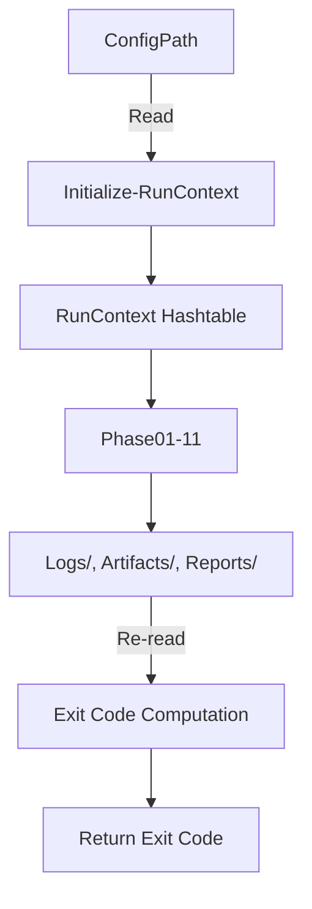
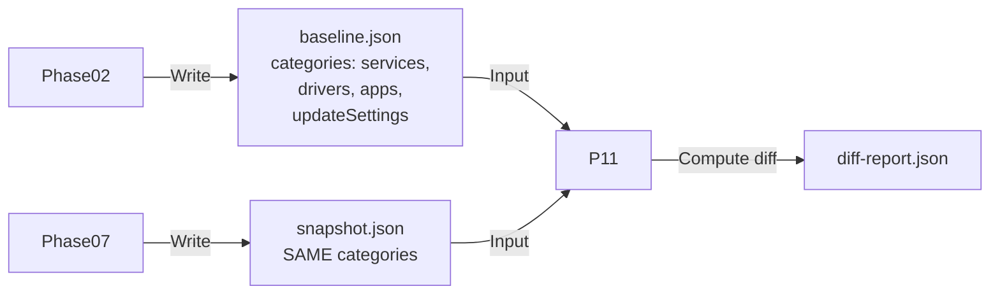
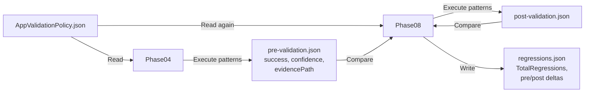
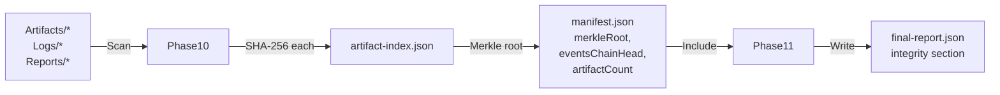
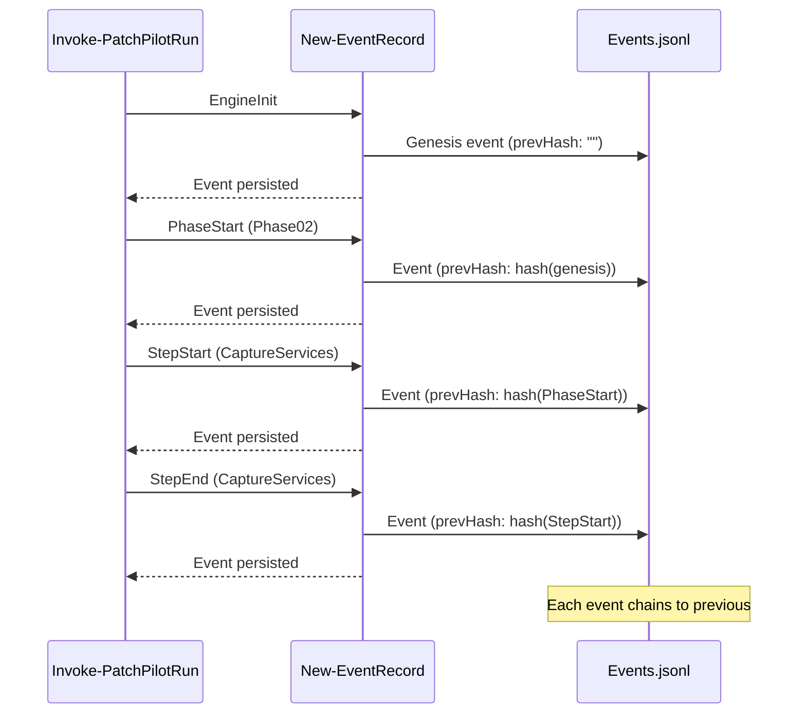
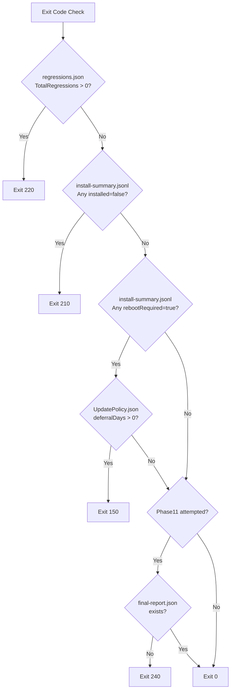
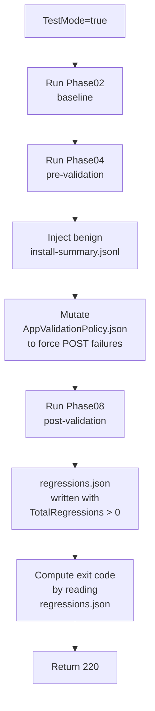
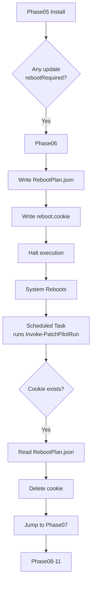

# Data Flow

This document describes how data moves through the 11 phases of PatchPilot.

## High-Level Flow



## Detailed Phase Data Flow

```mermaid
graph LR
    P01[Phase01<br/>Load Config] --> CTX[RunContext]
    CTX --> P02[Phase02<br/>Baseline]
    P02 -->|Write| B[baseline.json]
    B --> P04[Phase04<br/>Pre-Valid]
    P04 -->|Write| PV[pre-validation.json]
    PV --> P03[Phase03<br/>Catalog]
    P03 -->|Write| CAT[catalog.json]
    CAT --> P05[Phase05<br/>Install]
    P05 -->|Write| INS[install-summary.jsonl]
    INS --> P06{Phase06<br/>Reboot?}
    P06 -->|No| P07[Phase07<br/>Post-Snap]
    P06 -->|Yes| COOK[reboot.cookie]
    COOK -.Resume.-> P07
    P07 -->|Write| S[snapshot.json]
    S --> P08[Phase08<br/>Post-Valid]
    P08 -->|Write| REGR[regressions.json]
    REGR --> P09[Phase09<br/>LightDiag]
    P09 -->|Write| LightDiag[diagnostics-summary.json]
    LightDiag --> P10[Phase10<br/>Index]
    P10 -->|Write| MAN[manifest.json]
    MAN --> P11[Phase11<br/>Report]
    P11 -->|Read all| FINAL[final-report.json]
```



## Artifact Dependencies

### Phase02 → Phase07 (Snapshot Parity)



**Requirement:** `baseline.json` and `snapshot.json` must have **identical keys** to enable diff.

### Phase03 → Phase05 (Update Catalog)

```mermaid
graph LR
    POL[UpdatePolicy.json] -->|Read| P03[Phase03]
    P03 -->|Query COM| WU[Windows Update<br/>COM Session]
    WU -->|Filter| P03
    P03 -->|Write| CAT[catalog.json<br/>updates: [<br/> kb, title,<br/> classification,<br/> downloadSizeBytes<br/>]]
    CAT -->|Read| P05[Phase05]
    P05 -->|For each update| INST[Install via COM]
    INST -->|Append JSONL| SUMM[install-summary.jsonl]
```

### Phase04 → Phase08 (Validation)



### Phase10 → Phase11 (Integrity)



## Event Flow



**Hash Chaining:** Every event includes `prevHash` (SHA-256 of previous event's JSON).

## Exit Code Determination Flow



**Implementation:** `Invoke-PatchPilotRun.ps1` lines 249-301

**Evidence Sources:**
1. `Reports\<RunId>\regressions.json`
2. `Logs\install-summary.jsonl`
3. `examples\configs\UpdatePolicy.json`
4. `Reports\<RunId>\final-report.json`

## TestMode Flow

TestMode demonstrates evidence-first by mutating artifacts on disk:



**Implementation:** `Invoke-PatchPilotRun.ps1` lines 79-121

**Key Point:** TestMode does NOT set exit code in memory. It mutates artifacts, then re-reads them.

## Reboot Resume Flow



**Implementation:** `Invoke-PatchPilotRun.ps1` lines 125-148

**Artifacts:**
- `State\RebootPlan.json` - Stores `nextPhase`, `returnPath`, `timestamp`
- `State\reboot.cookie` - Marker file for detection

## Data Persistence Guarantees

| Phase | Persisted Artifact | Encoding | Hash | Read By |
|-------|-------------------|----------|------|---------|
| 01 | `State\state.json` | UTF-8 no BOM | - | Resume logic |
| 02 | `Artifacts\Baseline\<RunId>\baseline.json` | UTF-8 no BOM | SHA-256 | Phase11 |
| 03 | `Artifacts\UpdateCatalog\<RunId>\catalog.json` | UTF-8 no BOM | SHA-256 | Phase05 |
| 04 | `Reports\<RunId>\pre-validation.json` | UTF-8 no BOM | SHA-256 | Phase08, Phase11 |
| 05 | `Logs\install-summary.jsonl` | UTF-8 no BOM | SHA-256 | Exit code logic, Phase11 |
| 06 | `State\RebootPlan.json`, `State\reboot.cookie` | UTF-8 no BOM | - | Resume logic |
| 07 | `Artifacts\Snapshot\<RunId>\snapshot.json` | UTF-8 no BOM | SHA-256 | Phase11 |
| 08 | `Reports\<RunId>\regressions.json` | UTF-8 no BOM | SHA-256 | Exit code logic, Phase11 |
| 09 | `Artifacts\Diagnostics\LightDiag\<RunId>\diagnostics-summary.json` | UTF-8 no BOM | SHA-256 | Phase11 |
| 10 | `artifact-index.json`, `manifest.json` | UTF-8 no BOM | - | Phase11, auditors |
| 11 | `Reports\<RunId>\final-report.json` | UTF-8 no BOM | SHA-256 | Exit code logic, external tools |

**All Phases:** `Logs\Events.jsonl` (hash-chained, read by Phase10 for `eventsChainHead`)

## Summary

Data flows through PatchPilot in a **unidirectional, append-only** manner:
1. Phases **write** artifacts to disk immediately
2. Subsequent phases **read** artifacts (never assume in-memory state)
3. Exit codes are **computed** by re-reading artifacts (evidence-first)
4. Integrity is **verified** via hash chains (events) and Merkle roots (artifacts)

**No shortcuts.** All decisions trace to persisted evidence.

## References

- [Architecture Overview](Architecture.md)
- [Phases](Phases.md)
- [Evidence-First](Evidence-First.md)
- [Artifacts & Schemas](../API/Artifacts-and-Schemas.md)
