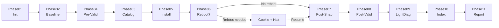

# Phase Reference

PatchPilot orchestrates patch management across **11 phases**. Each phase is idempotent, checkpointed, and emits structured events.

## Phase Execution Flow



## Phase01 - Initialization

**Purpose:** Setup RunContext, load configuration, validate environment

**Implementation:** Inline in `Invoke-PatchPilotRun.ps1` (lines 161-172)

**Key Actions:**
1. Initialize RunContext via `Initialize-RunContext` (in `src/PatchPilot.Engine/Private/Initialize-RunContext.ps1`)
2. Load `ClientProfile.json`
3. Emit `EngineInit` event (line 151)
4. Save checkpoint

**Outputs:**
- `State\state.json` - Checkpoint marker

**Events:**
- `EngineInit` (level: Info)
- `PhaseStart` (phaseId: "Phase01")
- `PhaseEnd` (success: true)

**Example Event:**
```json
{
  "timestamp": "2026-01-23T10:00:00Z",
  "runId": "abc123...",
  "event": "EngineInit",
  "level": "Info",
  "prevHash": "",
  "data": {
    "toolVersion": "1.0.0",
    "tenantId": "MSP001",
    "clientId": "ACME",
    "runId": "abc123..."
  }
}
```

---

## Phase02 - Baseline Snapshot

**Purpose:** Capture pre-patch system state for comparison

**Implementation:** `Invoke-Phase02` (in `src/PatchPilot.Engine/Private/Invoke-Phase02.ps1`)

**Key Actions (inferred from tests in `tests/StageE.Tests.ps1`):**
1. Capture services, drivers, installed apps, update settings
2. Use WMI/CIM where possible (e.g., `Win32_PnPSignedDriver`, `Get-Package`)
3. Save raw proofs (e.g., `driverquery /v` output) under `Artifacts\Baseline\<RunId>\raw\`
4. Write `baseline.json` with structured snapshot

**Outputs:**
- `Artifacts\Baseline\<RunId>\baseline.json` (schema: `data/schemas/baseline.schema.json`)
- `Artifacts\Baseline\<RunId>\raw\*` - Raw command outputs

**Events:**
- `PhaseStart` (phaseId: "Phase02", name: "Baseline Snapshot")
- `StepStart` / `StepEnd` for each category
- `PhaseEnd`

**Schema:** `data/schemas/baseline.schema.json`

**Snapshot Parity:** Phase02 and Phase07 capture **identical** categories to enable precise diff in reporting.

**Example Baseline Structure (inferred):**
```json
{
  "runId": "abc123...",
  "timestamp": "2026-01-23T10:01:00Z",
  "services": [
    { "name": "wuauserv", "status": "Running", "startType": "Automatic" }
  ],
  "drivers": [
    { "name": "nvlddmkm", "version": "30.0.15.1179", "provider": "NVIDIA" }
  ],
  "installedApps": [
    { "name": "Microsoft Edge", "version": "120.0.2210.121", "publisher": "Microsoft" }
  ],
  "updateSettings": {
    "autoUpdateEnabled": true,
    "lastSuccessTime": "2026-01-20T03:00:00Z"
  }
}
```

---

## Phase03 - Update Classification Fetch

**Purpose:** Query Windows Update metadata and persist catalog

**Implementation:** `Invoke-Phase03` (in `src/PatchPilot.Engine/Private/Invoke-Phase03.ps1`)

**Key Actions (from source, lines 42-60):**
1. Read `UpdatePolicy.json` from config directory
2. Create COM object: `Microsoft.Update.Session` → `CreateUpdateSearcher()`
3. Search for applicable updates: `Search("IsInstalled=0")`
4. Filter by classifications (from `UpdatePolicy.json`)
5. Persist to `Artifacts\UpdateCatalog\<RunId>\catalog.json`

**Outputs:**
- `Artifacts\UpdateCatalog\<RunId>\catalog.json`

**Events:**
- `PhaseStart` (phaseId: "Phase03", name: "Update Classification Fetch")
- `StepStart` / `StepEnd` (step: "LoadPolicy", "QueryUpdates", "FilterCatalog", "WriteCatalog")
- `UpdateQuerySuccess` / `UpdateQueryFailure`
- `PhaseEnd`

**Catalog Schema (inferred from Phase05 usage):**
```json
{
  "runId": "abc123...",
  "timestamp": "2026-01-23T10:02:00Z",
  "updates": [
    {
      "kb": "KB5012345",
      "title": "2026-01 Cumulative Update for Windows 10",
      "classification": "SecurityUpdates",
      "categoryIds": ["..."],
      "isSuperseded": false,
      "supersededBy": [],
      "downloadSizeBytes": 524288000,
      "revisionNumber": 1,
      "identity": { "updateId": "...", "revisionNumber": 1 }
    }
  ]
}
```

---

## Phase04 - Pre-Validation

**Purpose:** Validate business-critical apps **before** patching

**Implementation:** `Invoke-Phase04` (in `src/PatchPilot.Engine/Private/Invoke-Phase04.ps1`)

**Key Actions (from `tests/StageF.Tests.ps1`):**
1. Load `AppValidationPolicy.json`
2. For each app, execute validation patterns:
   - **Process** - Check if process running
   - **HealthEndpoint** - HTTP GET, check status code
   - **Synthetic** - Execute PowerShell command, check exit code
3. Compute confidence score per check
4. Write `Reports\pre-validation.json`

**Validation Patterns (from `examples/configs/AppValidationPolicy.json`):**
- `{ "type": "HealthEndpoint", "url": "...", "expectedStatus": 200 }`
- `{ "type": "Synthetic", "command": "...", "expectSuccess": true }`
- `{ "type": "Process", "target": "processName" }`

**Outputs:**
- `Reports\pre-validation.json` (schema: `data/schemas/validation-result.schema.json`)

**Example Pre-Validation Result (inferred):**
```json
{
  "runId": "abc123...",
  "timestamp": "2026-01-23T10:03:00Z",
  "when": "Pre",
  "applications": [
    {
      "name": "WebApp",
      "checks": [
        {
          "pattern": "HealthEndpoint",
          "success": true,
          "confidence": 1.0,
          "evidencePath": "Reports/abc123.../validation-evidence/pre-WebApp-HealthEndpoint.json",
          "notes": "HTTP 200 OK"
        }
      ],
      "overallConfidence": 1.0
    }
  ]
}
```

---

## Phase05 - Patch Install

**Purpose:** Install selected updates and persist install outcomes

**Implementation:** `Invoke-Phase05` (in `src/PatchPilot.Engine/Private/Invoke-Phase05.ps1`)

**Key Actions (from source):**
1. Read `catalog.json` from Phase03
2. For each update:
   - Emit `PatchInstallStart` event
   - Download and install via COM (`IUpdate.Download()`, `IUpdate.Install()`)
   - Capture HRESULT, reboot flag, duration
   - Append JSONL line to `Logs\install-summary.jsonl`
   - Emit `PatchInstallEnd` event
3. Save checkpoint

**Simulate Mode:** If `-Simulate:$true` (default in tests, line 185 of `Invoke-PatchPilotRun.ps1`), skip real COM calls and write realistic JSONL.

**Outputs:**
- `Logs\install-summary.jsonl` (schema: `data/schemas/install-summary.schema.json`)

**JSONL Format (from `Invoke-PatchPilotRun.ps1` line 90):**
```json
{"kb":"KB5012345","title":"2026-01 Cumulative","classification":"SecurityUpdates","downloaded":true,"installed":true,"hresult":0,"rebootRequired":false,"durationMs":42110}
```

**Exit Code Impact:**
- Any `installed: false` → exit code **210**
- Any `rebootRequired: true` AND `deferralDays > 0` → exit code **150**

---

## Phase06 - Reboot Orchestration

**Purpose:** Persist reboot plan and create cookie for resume

**Implementation:** `Invoke-Phase06` (in `src/PatchPilot.Engine/Private/Invoke-Phase06.ps1`)

**Key Actions (inferred from `Invoke-PatchPilotRun.ps1` lines 125-148):**
1. Check `install-summary.jsonl` for `rebootRequired: true`
2. If reboot needed:
   - Write `State\RebootPlan.json` (schema: `data/schemas/reboot-plan.schema.json`)
   - Create `State\reboot.cookie` (marker file)
   - Emit `RebootRequired` event
   - **Halt execution** (phases 07-11 run after reboot)
3. If no reboot needed:
   - Continue to Phase07

**Reboot Plan Schema (inferred):**
```json
{
  "nextPhase": "Phase07",
  "returnPath": "C:\\PatchPilot\\Engine\\Resume.ps1",
  "cookie": "State\\reboot.cookie",
  "timestamp": "2026-01-23T10:05:00Z"
}
```

**Resume Logic:** On next `Invoke-PatchPilotRun`, if cookie exists:
1. Read `RebootPlan.json`
2. Emit `RebootResumed` event
3. Delete cookie
4. Jump to Phase07

---

## Phase07 - Post-Snapshot

**Purpose:** Capture post-patch system state (same categories as Phase02)

**Implementation:** `Invoke-Phase07` (in `src/PatchPilot.Engine/Private/Invoke-Phase07.ps1`)

**Key Actions:** Identical to Phase02, but writes to `Artifacts\Snapshot\<RunId>\`

**Outputs:**
- `Artifacts\Snapshot\<RunId>\snapshot.json` (schema: `data/schemas/snapshot.schema.json` - identical to baseline.schema.json)
- `Artifacts\Snapshot\<RunId>\raw\*`

**Snapshot Parity Requirement (from `tests/StageE.Tests.ps1`):**
- Phase02 and Phase07 must capture **identical keys**
- This enables diff computation in Phase11

---

## Phase08 - Post-Validation

**Purpose:** Re-run validation patterns and detect regressions

**Implementation:** `Invoke-Phase08` (in `src/PatchPilot.Engine/Private/Invoke-Phase08.ps1`)

**Key Actions (from `tests/StageF.Tests.ps1`):**
1. Load `AppValidationPolicy.json` (same as Phase04)
2. Re-execute validation patterns
3. Write `Reports\post-validation.json`
4. Compare pre vs. post results
5. Write `Reports\regressions.json` (schema: `data/schemas/regressions.schema.json`)

**Regression Detection (inferred from TestMode logic in `Invoke-PatchPilotRun.ps1` lines 95-112):**
- If a check succeeded PRE but failed POST → regression
- If confidence dropped significantly → regression
- If HTTP endpoint returns different status → regression

**Regressions Schema (inferred):**
```json
{
  "runId": "abc123...",
  "timestamp": "2026-01-23T10:07:00Z",
  "TotalRegressions": 1,
  "applications": [
    {
      "name": "WebApp",
      "regressions": [
        {
          "pattern": "HealthEndpoint",
          "preSuccess": true,
          "postSuccess": false,
          "preConfidence": 1.0,
          "postConfidence": 0.0,
          "notes": "HTTP endpoint unreachable after patching"
        }
      ]
    }
  ]
}
```

**Exit Code Impact:** If `TotalRegressions > 0` → exit code **220**

---

## Phase09 - Diagnostics/LightDiag

**Purpose:** Collect inbox-only diagnostic evidence using PatchPilot's built-in LightDiag collectors (no external downloads).

**Implementation:** `Invoke-Phase09` (in `src/PatchPilot.Engine/Private/Invoke-Phase09.ps1`)

**When it runs (config: top-level `diagnostics` block):**
- `mode`: `Never` | `Always` | `OnFailure`
- If `mode = OnFailure`, Phase09 runs when either condition is true:
  - any `installed = false` in `Logs\install-summary.jsonl`
  - `Reports\regressions.json` has `TotalRegressions > 0`

**Throttling (best-effort):**
- Uses `throttlingWindowMin` and a persisted history file to avoid repeatedly collecting heavy diagnostics.
- History file location:
  - Preferred: `DeviceStateRoot\diagnostics-run-history.json` (tenant/client/site/device-scoped)
  - Fallback: `RunRoot\State\diagnostics-run-history.json`

**Caps (enforced):**
- `maxRuntimeSeconds`
- `maxTotalOutputMb`
- `maxPerArtifactMb`

**Artifacts:**
- Summary (always written when Phase09 runs):
  - `RunRoot\Artifacts\Diagnostics\LightDiag\<RunId>\diagnostics-summary.json`
- Collector artifacts are written under:
  - `RunRoot\Artifacts\Diagnostics\LightDiag\<RunId>\...`

**Required vs best-effort behavior:**
- If `diagnostics.required = true` **and** Phase09 ends with `status = Fail`, Phase09 sets `Context.ExitCode = 230` and throws. `Invoke-PatchPilotRun` propagates 230 to the process exit code.
- Otherwise, Phase09 records failures in the summary and continues the run.

**LightDiag Summary Schema:** `data/schemas/diagnostics-summary.schema.json`

**Example:**
```json
{
  "schemaVersion": "1.0",
  "runId": "abc123...",
  "generatedUtc": "2026-01-23T10:08:00Z",
  "profile": "LightDiag",
  "mode": "OnFailure",
  "status": "Success",
  "triggeredBy": ["InstallFailure"],
  "caps": {
    "maxRuntimeSeconds": 600,
    "maxTotalOutputMb": 200,
    "maxPerArtifactMb": 50
  },
  "throttlingWindowMin": 60,
  "capExceeded": false,
  "durationMs": 12345,
  "totalArtifacts": 4,
  "totalBytes": 1048576,
  "collectors": [
    { "name": "EventLog", "status": "Success", "artifacts": 1, "bytes": 123456 },
    { "name": "Files", "status": "Success", "artifacts": 2, "bytes": 789012 },
    { "name": "Commands", "status": "Skipped", "artifacts": 0, "bytes": 0 }
  ],
  "artifacts": [
    {
      "collector": "EventLog",
      "name": "System.evtx",
      "path": "Artifacts/Diagnostics/LightDiag/abc123.../EventLog/System.evtx",
      "sizeBytes": 123456,
      "sha256": "a3c9f12e8b5d3c1a2e4f6b7c8d9e0f1a2b3c4d5e6f7a8b9c0d1e2f3a4b5c6d7"
    }
  ]
}
```

**Exit Code Impact:**
- **230** only when `diagnostics.required = true` and Phase09 fails.

---

## Phase10 - Evidence Indexing

**Purpose:** Build artifact index and compute integrity proofs

**Implementation:** `New-ArtifactIndex` and `Write-Manifest` (in `src/PatchPilot.Engine/Private/`)

**Key Actions:**
1. **Build Artifact Index:**
   - Scan all files under `Artifacts\`, `Logs\`, `Reports\`
   - Compute SHA-256 via `Get-FileSha256` (in `src/PatchPilot.Engine/Private/Get-FileSha256.ps1`)
   - Write `artifact-index.json` (schema: `data/schemas/artifact-index.schema.json`)

2. **Write Manifest:**
   - Compute Merkle root over artifact SHA-256 hashes
   - Read final event from `Events.jsonl` and hash it → `eventsChainHead`
   - Write `manifest.json` (schema: `data/schemas/manifest.schema.json`)

**Artifact Index Example:**
```json
[
  {
    "path": "Artifacts/Baseline/abc123.../baseline.json",
    "sha256": "d2a84f4b8b650937ec8f73cd8be2c74add5a911ba64df27458ed8229da804a26",
    "category": "Baseline",
    "size": 4096
  },
  {
    "path": "Logs/install-summary.jsonl",
    "sha256": "e3b0c44298fc1c149afbf4c8996fb92427ae41e4649b934ca495991b7852b855",
    "category": "Logs",
    "size": 512
  }
]
```

**Manifest Example (from `data/schemas/manifest.schema.json`):**
```json
{
  "runId": "abc123...",
  "merkleRoot": "f7c3bc1d808e04732adf679965ccc34ca7ae3441",
  "artifactCount": 17,
  "eventsChainHead": "a3c9f12e8b5d3c1a2e4f6b7c8d9e0f1a2b3c4d5e6",
  "timestamp": "2026-01-23T10:09:00Z",
  "tenantId": "MSP001",
  "clientId": "ACME",
  "deviceId": "WIN-SERVER01"
}
```

---

## Phase11 - Reporting

**Purpose:** Build final report from persisted evidence ONLY

**Implementation:** `Invoke-Phase11` (in `src/PatchPilot.Engine/Private/Invoke-Phase11.ps1`)

**Key Actions (from `Invoke-PatchPilotRun.ps1` lines 217-222):**
1. Read all artifacts from disk (evidence-first):
   - `Logs\install-summary.jsonl`
   - `Reports\pre-validation.json`
   - `Reports\post-validation.json`
   - `Reports\regressions.json`
   - `Artifacts\Baseline\<RunId>\baseline.json`
   - `Artifacts\Snapshot\<RunId>\snapshot.json`
   - `Artifacts\Diagnostics\LightDiag\<RunId>\diagnostics-summary.json`
   - `artifact-index.json`
   - `manifest.json`
2. Compute diff between baseline and snapshot
3. Build `StandardsEvidenceMap` (see [Compliance Mapping](../SECURITY-COMPLIANCE/Compliance-Mapping.md))
4. Write `Reports\final-report.json` and `final-report.html`

**Final Report Schema (from `data/schemas/final-report.schema.json`, inferred):**
```json
{
  "runId": "abc123...",
  "timestamp": "2026-01-23T10:10:00Z",
  "tenantId": "MSP001",
  "clientId": "ACME",
  "summary": {
    "totalUpdates": 3,
    "installedUpdates": 3,
    "failedUpdates": 0,
    "rebootRequired": false,
    "regressions": 0,
    "exitCode": 0
  },
  "installSummary": [...],
  "validation": {
    "pre": {...},
    "post": {...},
    "regressions": {...}
  },
  "systemDiff": {
    "servicesChanged": [],
    "driversAdded": [],
    "driversRemoved": []
  },
  "diagnostics": {
    "collectorsRun": 3,
    "totalSizeBytes": 1048576
  },
  "standardsEvidenceMap": {
    "NIST_SP_800_40r4": [...],
    "NIST_800_53r5": [...],
    "CIS_v8": [...]
  },
  "integrity": {
    "merkleRoot": "f7c3bc1d808e04732adf679965ccc34ca7ae3441",
    "eventsChainHead": "a3c9f12e8b5d3c1a2e4f6b7c8d9e0f1a2b3c4d5e6",
    "artifactCount": 17
  }
}
```

**Exit Code Impact:** If Phase11 attempted but `final-report.json` missing → exit code **240**

---

## Summary Table

| Phase | Name | Implementation | Key Artifact | Exit Impact |
|-------|------|----------------|--------------|-------------|
| 01 | Initialization | Inline | `State\state.json` | - |
| 02 | Baseline Snapshot | `Invoke-Phase02` | `baseline.json` | - |
| 03 | Update Catalog | `Invoke-Phase03` | `catalog.json` | - |
| 04 | Pre-Validation | `Invoke-Phase04` | `pre-validation.json` | - |
| 05 | Patch Install | `Invoke-Phase05` | `install-summary.jsonl` | 210 (fail), 150 (reboot) |
| 06 | Reboot Orchestration | `Invoke-Phase06` | `RebootPlan.json` | - |
| 07 | Post-Snapshot | `Invoke-Phase07` | `snapshot.json` | - |
| 08 | Post-Validation | `Invoke-Phase08` | `regressions.json` | 220 (regression) |
| 09 | Diagnostics/LightDiag | `Invoke-Phase09` | `diagnostics-summary.json` | 230 (required failure) |
| 10 | Evidence Indexing | `New-ArtifactIndex`, `Write-Manifest` | `artifact-index.json`, `manifest.json` | - |
| 11 | Reporting | `Invoke-Phase11` | `final-report.json` | 240 (missing report) |

---

## References

- [Architecture Overview](Architecture.md)
- [Evidence-First](Evidence-First.md)
- [Exit Codes](../API/Exit-Codes.md)
- [Artifacts & Schemas](../API/Artifacts-and-Schemas.md)
