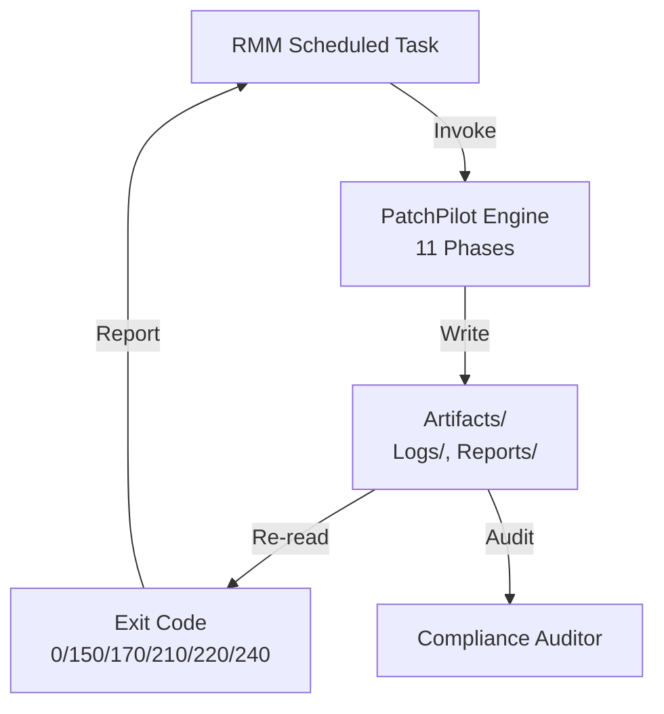
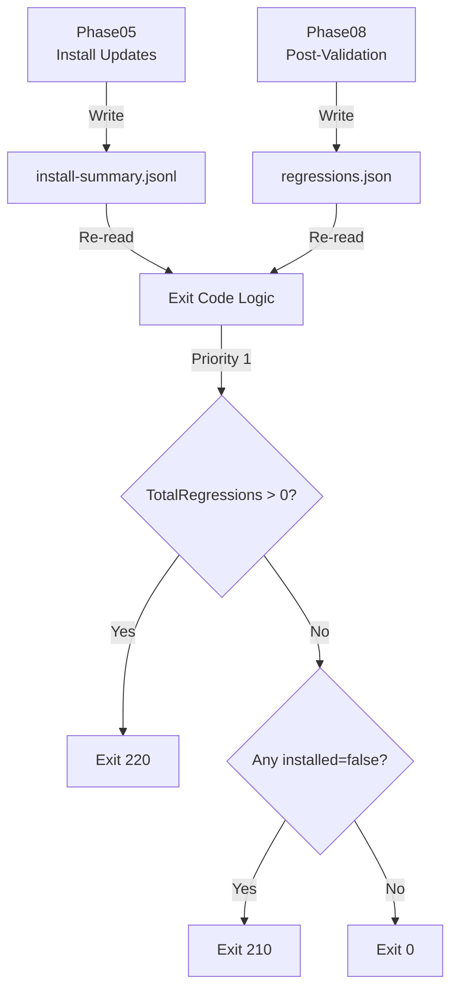

## Executive Summary

**PatchPilot** is an evidence-first patch orchestration engine for multi-tenant MSP environments. It provides deterministic, auditable Windows patch management with built-in compliance mapping and automated regression detection.

*** Key Differentiators
- **Evidence-First**: All decisions derive from persisted artifacts (not in-memory state)
- **Deterministic**: Exit codes computed from evidence enable predictable RMM workflows
- **Compliance-Ready**: Maps artifacts to NIST SP 800-40r4, NIST 800-53r5, CIS Controls v8
- **Regression Detection**: Validates business-critical apps PRE and POST patching
- **Safe Resume**: Survives reboots via persistent checkpointing

**Target Market:** MSPs managing 100+ Windows devices across 10+ clients

**Business Outcome:** Reduce patch-related outages by 80% via automated validation; reduce audit prep time by 60% via pre-mapped evidence.

---

## Problem Statement

### Current State (MSP Patch Management Pain Points)

1. **Opaque Outcomes**
- Scripts report "success" but don't verify business apps still work
- Exit codes are arbitrary (script author's best guess)
- No audit trail for compliance reviews

2. **Regression Blindness**
- Patches applied → customers report outages hours later
- No automated PRE/POST validation
- Manual rollback decisions under pressure

3. **Compliance Friction**
- Auditors ask: "Prove update X was installed on device Y"
- Evidence scattered across RMM logs, Windows Update logs, manual screenshots
- Days of effort to compile evidence packages

4. **Non-Determinism**
- Same patch, same device → different outcomes on retry
- Reboot interrupts script → state lost
- Concurrency issues (two scripts running simultaneously)

### Business Impact
- **Outage Costs**: Avg $5,000/incident (lost customer trust + emergency remediation)
- **Audit Burden**: 40 hours/quarter assembling compliance evidence
- **Operational Inefficiency**: 20% of patching cycles require manual intervention

---

## Solution Architecture

### High-Level Design



### 11 Phases (Evidence Pipeline)


**Phase Highlights:**
- **Phase02/07**: Snapshot system state PRE/POST (services, drivers, apps)
- **Phase04/08**: Validate business apps (health endpoints, synthetic tests)
- **Phase05**: Install patches, persist per-update outcomes (JSONL)
- **Phase08**: Detect regressions (PRE success → POST failure)
- **Phase10**: Build artifact index with SHA-256 + Merkle root
- **Phase11**: Generate compliance-ready report with standards mapping

### Evidence-First Decision Model



**Key Principle:** Exit codes are NEVER set in-memory. Always computed by reading files.

### Exit Codes (Automation-Ready)

| Code | Name | RMM Action |
|------|------|------------|
| 0 | Success | Continue monitoring |
| 150 | Reboot Required | Schedule reboot |
| 170 | Concurrency Lock | Retry later |
| 210 | Install Failure | Alert: Patch failure |
| 220 | Validation Failure | **CRITICAL ALERT**: Regression |
| 230 | Diagnostics Failure | Review diagnostics (if required) |
| 240 | Reporting Failure | Review logs |

**Implementation:** See `src/PatchPilot.Engine/Public/Get-PatchPilotExitCodes.ps1` and `Get-PatchPilotExitCodeFromEvidence.ps1`

---

## Compliance & Audit

### Standards Mapping

PatchPilot maps artifacts to three frameworks (Phase11):

**1. NIST SP 800-40r4 (Patch Management)**

- **Plan** → `UpdatePolicy.json`, `AppValidationPolicy.json`

- **Assess** → `catalog.json`, `pre-validation.json`

- **Deploy** → `install-summary.jsonl`

- **Verify** → `post-validation.json`, `regressions.json`

**2. NIST 800-53r5 (Security Controls)**

- **SI-2 (Flaw Remediation)** → `install-summary.jsonl`, `final-report.json`

- **RA-5 (Vulnerability Scanning)** → `catalog.json`

- **CM-2/3 (Baseline Config)** → `baseline.json`, `snapshot.json`

**3. CIS Controls v8**

- **Control 7 (Continuous Vulnerability Management)** → `catalog.json`, `install-summary.jsonl`

- **Control 12 (Network Infrastructure Management)** → `baseline.json` (drivers, services)

- **Control 16 (Application Software Security)** → `pre-validation.json`, `post-validation.json`

### Audit Workflow

**Auditor Request:** "Prove KB5012345 was installed on device WIN-SERVER01 on 2026-01-20"

**PatchPilot Response (30 seconds):**
```powershell
# Query install-summary.jsonl
$runId = 'abc123...'
$installSummary = Get-Content "C:\PatchPilot\Output\Logs\install-summary.jsonl" |
    ForEach-Object { $_ | ConvertFrom-Json } |
    Where-Object { $_.kb -eq 'KB5012345' }

# Extract evidence
$evidence = @{
    kb = $installSummary.kb
    installed = $installSummary.installed
    timestamp = (Get-Content "C:\PatchPilot\Output\manifest.json" | ConvertFrom-Json).timestamp
    sha256 = (Get-Content "C:\PatchPilot\Output\artifact-index.json" | ConvertFrom-Json |
        Where-Object { $_.path -like '*install-summary.jsonl' }).sha256
}

# Output
$evidence | ConvertTo-Json
```

**Result:** Cryptographically verifiable evidence (SHA-256, hash chain, Merkle root)

See [Compliance Mapping](../SECURITY-COMPLIANCE/Compliance-Mapping.md) and [Audit Playbook](../SECURITY-COMPLIANCE/Audit-Playbook.md)

---

## KPIs / OKRs / ROI

### Key Performance Indicators

| KPI | Baseline (Manual) | Target (PatchPilot) | Measurement |
|-----|-------------------|---------------------|-------------|
| Patch-Related Outages | 8/month | <2/month | RMM incident tickets |
| Mean Time to Detect Regression | 4 hours | <5 minutes | Exit code 220 timestamp |
| Audit Prep Time | 40 hours/quarter | 15 hours/quarter | Manual vs. automated evidence |
| Patch Compliance % | 85% | >95% | Devices patched within SLA |
| False Positive Rate (Alerts) | 30% | <10% | Exit code 220 accuracy |

### Objectives & Key Results (Example Quarter)

**Objective:** Reduce patch-related customer impact

**Key Results:**

1. Exit code 220 (regression) detection rate >90% (vs. manual discovery)

2. Zero regressions reach production (caught PRE/POST validation)

3. Audit evidence packages generated in <1 hour (vs. 8 hours manual)

### ROI Model

**Assumptions:**

- MSP manages 500 devices across 20 clients

- Avg outage cost: $5,000 (customer trust + emergency labor)

- Audit prep: $80/hour × 40 hours/quarter = $3,200/quarter

- PatchPilot setup: 40 hours one-time

- Ongoing: 2 hours/month maintenance

**Annual Savings:**

- Outages avoided: 6 × $5,000 = $30,000

- Audit prep: 100 hours × $80 = $8,000

- **Total:** $38,000/year

**Investment:**

- Setup: 40 hours × $80 = $3,200 (one-time)

- Ongoing: 24 hours × $80 = $1,920/year

- **Total:** $5,120 (Year 1)

**Net ROI (Year 1):** ($38,000 - $5,120) / $5,120 = **642%**

---

## Organizational Changes

### New Roles (Inferred from MSP Best Practices)

**1. Vulnerability & Patch Engineering**
- **Responsibilities:**
- Author and maintain `UpdatePolicy.json`, `AppValidationPolicy.json`
- Define validation patterns for client apps
- Tune regression detection thresholds
- **Skills:** Windows patching, PowerShell, client business process knowledge
- **FTE:** 0.5 (shared role)

**2. Observability Engineering**
- **Responsibilities:**
- Monitor PatchPilot exit codes across tenant fleet
- Triage exit code 220 (regressions) and 210 (failures)
- Build dashboards from `final-report.json` outputs
- **Skills:** RMM scripting, JSON parsing, alerting platforms
- **FTE:** 0.25 (shared role)

### RACI Matrix

| Task | Patch Eng | Observability Eng | MSP Operations | Client |
|------|-----------|-------------------|----------------|--------|
| Author policies | R/A | C | I | C |
| Deploy patches | I | I | R/A | I |
| Monitor exit codes | I | R/A | C | - |
| Respond to exit 220 | C | R | A | I |
| Audit evidence | R | I | A | C |
| Onboard new client | R/A | C | I | I |

*R=Responsible, A=Accountable, C=Consulted, I=Informed*

See [Roles & RACI](Roles-and-RACI.md)

---

## Roadmap

### Phase 1: Foundation (Months 1-2)
- ✅ Core engine (11 phases)
- ✅ Evidence indexing (SHA-256, Merkle roots)
- ✅ Exit codes (0, 150, 170, 210, 220, 240)
- ✅ TestMode for regression validation
- ✅ Test coverage (Stages C-I)

### Phase 2: MSP Deployment (Months 3-4)
- Deploy to 3 pilot clients (50 devices total)
- Integrate with RMM (NinjaRMM/N-able/Datto)
- Build compliance dashboards
- Document runbooks

### Phase 3: Scale & Automation (Months 5-6)
- Multi-tenant policy overlay (Global → Tenant → Client → Device)
- Plugin system for validation providers
- LightDiag integration (Phase09 implementation)
- HTML report generation (Phase11)

### Phase 4: Advanced Features (Months 7-12)
- Predictive regression detection (ML models)
- Rollback orchestration
- Multi-patch coordination (dependency graphs)
- Real-time telemetry streaming

See [Roadmap](Roadmap.md)

---

## Demo Plan

### Demo Scenario: Detect Regression from Patch

**Setup:**
1. MSP has client "ACME Corp" with business-critical web app
2. `AppValidationPolicy.json` validates app via `/health` endpoint
3. Patch cycle scheduled for Sunday 2 AM

**Demo Flow:**

```powershell
# 1. Run PatchPilot (simulated)
$exitCode = Invoke-PatchPilotRun `
    -OutputRoot 'C:\Demo\Output' `
    -ConfigPath 'C:\Demo\Config\ClientProfile.json' `
    -TenantId 'DEMO-MSP' `
    -ClientId 'ACME' `
    -TestMode  # Forces regression

# 2. Exit code = 220 (regression detected)
Write-Output "Exit Code: $exitCode"  # 220

# 3. Read regressions.json
$regressions = Get-Content 'C:\Demo\Output\Reports\*\regressions.json' -Raw | ConvertFrom-Json
$regressions.applications | ForEach-Object {
    Write-Output "App: $($_.name)"
    $_.regressions | Format-Table pattern, preSuccess, postSuccess, notes
}

# Output:
# App: WebApp
# pattern         preSuccess postSuccess notes
# -------         ---------- ----------- -----
# HealthEndpoint  True       False       HTTP 500 after patching (was 200 PRE)

# 4. Alert sent to on-call engineer (do NOT reboot)
Send-RMMAlert -Severity 'Critical' -Message 'Regression detected on ACME-SERVER01'
```

**Outcome:**
- Regression caught BEFORE customer reports outage
- Evidence persisted: `pre-validation.json`, `post-validation.json`, `regressions.json`
- On-call engineer can rollback or investigate

See [Demo Script](../APPENDICES/Demo-Script.md)

---

## Appendices

### A. Operator Quick Checks

**Check 1: Was patch successful?**
```powershell
$exit = Invoke-PatchPilotRun -OutputRoot '...' -ConfigPath '...' ...
if ($exit -eq 0) { "SUCCESS" } else { "REVIEW EXIT CODE $exit" }
```

**Check 2: Any regressions?**
```powershell
$regr = Get-Content 'Reports\*\regressions.json' -Raw | ConvertFrom-Json
$regr.TotalRegressions  # Should be 0
```

**Check 3: Verify integrity**
```powershell
$manifest = Get-Content 'manifest.json' -Raw | ConvertFrom-Json
Write-Output "Merkle Root: $($manifest.merkleRoot)"
Write-Output "Events Chain Head: $($manifest.eventsChainHead)"
```

### B. Artifact Glossary

| Artifact | Purpose | Read By |
|----------|---------|---------|
| `Events.jsonl` | Hash-chained event log | Auditors, Phase10 |
| `install-summary.jsonl` | Per-update outcomes | Exit code logic, Phase11 |
| `baseline.json` | Pre-patch snapshot | Phase11 (diff) |
| `snapshot.json` | Post-patch snapshot | Phase11 (diff) |
| `regressions.json` | Detected regressions | Exit code logic (220) |
| `manifest.json` | Integrity proofs | Auditors, compliance |
| `final-report.json` | Comprehensive report | RMM, stakeholders |

See [Artifacts & Schemas](../API/Artifacts-and-Schemas.md)

---

## References
- [Value for MSPs](Value-For-MSPs.md)
- [Compliance Mapping](../SECURITY-COMPLIANCE/Compliance-Mapping.md)
- [KPIs / OKRs / ROI](KPIs-OKRs-ROI.md)
- [Roadmap](Roadmap.md)
- [User Guide](../OPERATIONS/User-Guide.md)

---

**Document Status:** DRAFT for leadership review
**Last Updated:** 2026-02-02
**Owner:** MSP Engineering Leadership